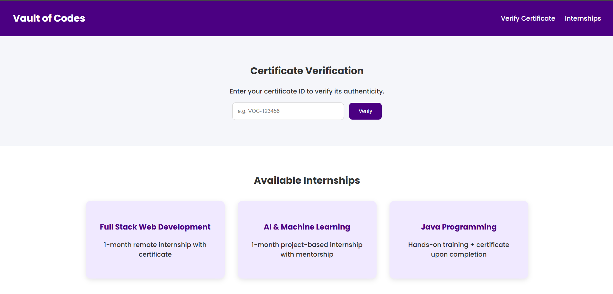

# Vault of Codes – Certificate Verification Portal

This project is a modern, responsive web page built as part of an internship task to enhance the existing Vault of Codes website. It includes a certificate verification feature and displays available internships.

# Features

- Certificate Verification 
Users can enter a certificate ID and verify its authenticity through a simulated check. 

- Internship Listings 
Showcases three internship programs with simple UI cards. 

- Responsive Design 
Fully responsive across desktops, tablets, and mobile devices. 

- Modern UI/UX 
Built with HTML5, CSS3, and JavaScript using a clean and structured layout. 

# Project Structure

. 
├── index.html        # Main HTML structure 
├── style.css         # Styling with media queries 
└── script.js         # Certificate validation logic 

# Built With

- HTML5 
- CSS3 (with Flexbox & Media Queries) 
- JavaScript (vanilla) 

# Sample Valid Certificate IDs

Use any of the following to test verification: 
 
VOC-123456 
VOC-FS2025 
VOC-AIML001 

# Screenshot

Link : https://akankshap-vaultofcodes-task-3.netlify.app